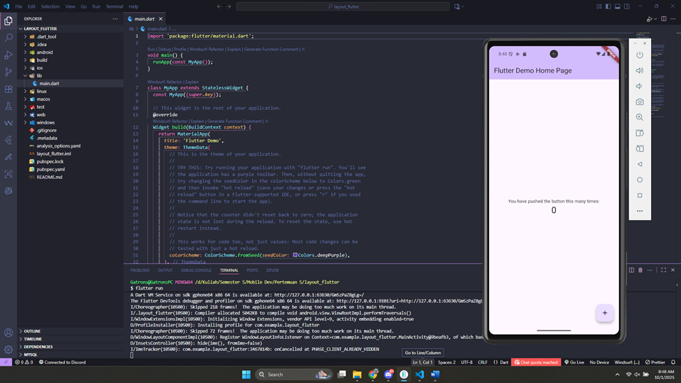

# 📱 Praktikum Flutter — Hello World & Widget Dasar

**Mata Kuliah:** Pemrograman Mobile
**Nama:** Iga Ramadana Sahputra  
**NIM:** 2341760083  
**Kelas:** SIB 3C  
**No Absen:** 15

**Repository:** [PMB_JS05 - Layout dan Navigasi](https://github.com/igaramadana/PMB_JS05)

---

## 📌 Praktikum 1: Membuat Project Flutter Baru & Menjalankan Project di Emulator

- Membuat project `layout_flutter` dengan **VS Code**.
- Struktur project berhasil dibuat dengan pesan: `Your Flutter Project is ready!`.

📷 **Screenshot:**  


---

## 📌 Praktikum 2: Membangun Layout di Flutter

- Buka file main.dart lalu ganti dengan kode berikut. Isi nama dan NIM Anda di text title.

```
import 'package:flutter/material.dart';

void main() => runApp(const MyApp());

class MyApp extends StatelessWidget {
  const MyApp({super.key});

  @override
  Widget build(BuildContext context) {
    return MaterialApp(
      title: 'Flutter layout: Nama dan NIM Anda',
      home: Scaffold(
        appBar: AppBar(
          title: const Text('Flutter layout demo'),
        ),
        body: const Center(
          child: Text('Hello World'),
        ),
      ),
    );
  }
}
```

- Implementasi title row

```
Widget get titleSection => Container(
    padding: const EdgeInsets.all(32.0),
    child: Row(
      children: [
        Expanded(
          /* soal 1*/
          child: Column(
            crossAxisAlignment: CrossAxisAlignment.start,
            children: [
              /* soal 2*/
              Container(
                padding: const EdgeInsets.only(bottom: 8.0),
                child: const Text(
                  'Wisata Gunung di Batu',
                  style: TextStyle(fontWeight: FontWeight.bold),
                ),
              ),
              Text(
                'Batu, Malang, Indonesia',
                style: TextStyle(color: Colors.grey[500]),
              ),
            ],
          ),
        ),
        /* soal 3*/
        Icon(Icons.star, color: Colors.red),
        const Text('41'),
      ],
    ),
  );
```

- Memanggil widget titleSection di MaterialApp

```
Widget build(BuildContext context) {
    return MaterialApp(
      title: 'Flutter layout: Iga Ramadana Sahputra - 2341760083',
      home: Scaffold(
        appBar: AppBar(title: const Text('Flutter layout demo')),
        body: Column(
          children: [
            titleSection,
          ],
        ),
      ),
    );
  }
```

- Hasil Output
  📷 **Screenshot Hasil:**  
  

---

## 📌 Praktikum 3: Implementasi button row

- Buat method Column \_buildButtonColumn

```
class MyApp extends StatelessWidget {
  const MyApp({super.key});

  @override
  Widget build(BuildContext context) {
    // ···
  }

  Column _buildButtonColumn(Color color, IconData icon, String label) {
    return Column(
      mainAxisSize: MainAxisSize.min,
      mainAxisAlignment: MainAxisAlignment.center,
      children: [
        Icon(icon, color: color),
        Container(
          margin: const EdgeInsets.only(top: 8),
          child: Text(
            label,
            style: TextStyle(
              fontSize: 12,
              fontWeight: FontWeight.w400,
              color: color,
            ),
          ),
        ),
      ],
    );
  }
}
```

- Buat widget buttonSection

```
Color color = Theme.of(context).primaryColor;

Widget buttonSection = Row(
  mainAxisAlignment: MainAxisAlignment.spaceEvenly,
  children: [
    _buildButtonColumn(color, Icons.call, 'CALL'),
    _buildButtonColumn(color, Icons.near_me, 'ROUTE'),
    _buildButtonColumn(color, Icons.share, 'SHARE'),
  ],
);
```

- Tambah button section ke body

```
body: Column(children: [titleSection, ButtonSection]),
```

- Hasil Output
  📷 **Screenshot Hasil:**  
  

---

## 📌 Praktikum 4: Implementasi text section

- Buat widget textSection

```
Widget textSection = Container(
      padding: const EdgeInsets.all(32),
      child: const Text(
        'Batu adalah sebuah kota di Provinsi Jawa Timur, Indonesia. Kota ini terletak sekitar 20 kilometer di sebelah barat laut Kota Malang. Batu dikenal sebagai tujuan wisata yang populer, terutama karena udaranya yang sejuk dan pemandangan alamnya yang indah. Beberapa tempat wisata terkenal di Batu antara lain Jatim Park, Museum Angkut, dan Selecta.'
        '- Iga Ramadana Sahputra - 2341760083',
        textAlign: TextAlign.justify,
        softWrap: true,
      ),
    );
```

- Tambahkan variabel text section ke body

```
body: Column(children: [titleSection, buttonSection, textSection]),
```

- Hasil Output
  📷 **Screenshot Hasil:**  
  

---

## 📌 Praktikum 5: Implementasi image section

- Siapkan aset gambar
  buat folder baru bernama `images` lalu set nama file tersebut didalam file `pubspec.yaml` seperti berikut:

```
flutter:
  uses-material-design: true
  assets:
    - images/image.png
```

- Tambahkan gambar ke body

```
body: Column(
          children: [
            Image.asset(
              'images/image.png',
              width: 600,
              height: 240,
              fit: BoxFit.cover,
            ),
            buttonSection,
            textSection,
          ],
        ),
```

- Terakhir, ubah menjadi ListView

```
Widget textSection = Container(
      padding: const EdgeInsets.all(32),
      child: const Text(
        'Batu adalah sebuah kota di Provinsi Jawa Timur, Indonesia. Kota ini terletak sekitar 20 kilometer di sebelah barat laut Kota Malang. Batu dikenal sebagai tujuan wisata yang populer, terutama karena udaranya yang sejuk dan pemandangan alamnya yang indah. Beberapa tempat wisata terkenal di Batu antara lain Jatim Park, Museum Angkut, dan Selecta.'
        '- Iga Ramadana Sahputra - 2341760083',
        textAlign: TextAlign.justify,
        softWrap: true,
      padding: const EdgeInsets.fromLTRB(32, 24, 32, 32),
      child: const Column(
        crossAxisAlignment: CrossAxisAlignment.start,
        children: [
          Text(
            'Deskripsi Wisata',
            style: TextStyle(
              fontWeight: FontWeight.w600,
              fontSize: 18,
              color: Colors.black87,
            ),
          ),
          SizedBox(height: 12),
          Text(
            'Batu adalah sebuah kota di Provinsi Jawa Timur, Indonesia. Kota ini terletak sekitar 20 kilometer di sebelah barat laut Kota Malang. Batu dikenal sebagai tujuan wisata yang populer, terutama karena udaranya yang sejuk dan pemandangan alamnya yang indah. Beberapa tempat wisata terkenal di Batu antara lain Jatim Park, Museum Angkut, dan Selecta.',
            textAlign: TextAlign.justify,
            style: TextStyle(fontSize: 14, height: 1.5, color: Colors.black87),
          ),
          SizedBox(height: 16),
          Text(
            '- Iga Ramadana Sahputra - 2341760083',
            style: TextStyle(
              fontSize: 12,
              fontStyle: FontStyle.italic,
              color: Colors.grey,
            ),
          ),
        ],
      ),
    );
)
```

- Hasil Output
  📷 **Screenshot Hasil:**  
  
